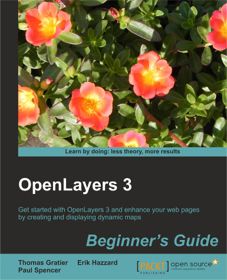

# OpenLayers 3 Beginner’s Guide

This website is the companion to the book *OpenLayers 3 Beginner’s Guide* published by Packt Publishing by Thomas Gratier, Paul Spencer and Erik Hazzard.

You can acquire the book from [Packt Publishing dedicated page](https://www.packtpub.com/web-development/openlayers-3-beginner%E2%80%99s-guide)

You will find **all samples** published in this site. Except some of them, they do not rely on a server side. Feel free to use them.

The latest features of the library are not covered as the book was written to cover version 3.0.

New components such as ol.control.OverviewMap have been added since the 3.0 release.

For any particular requests, contact us via Twitter <http://twitter.com/ThomasG77> or <https://twitter.com/pagameba>

You can also submit a bug report at <https://github.com/openlayersbook/openlayersbook>

